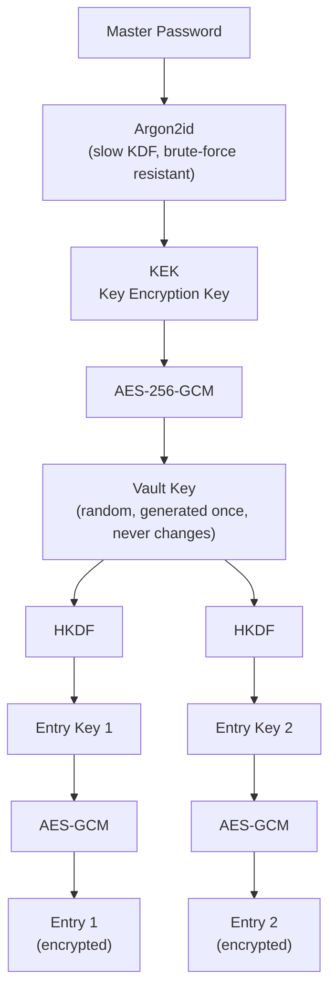
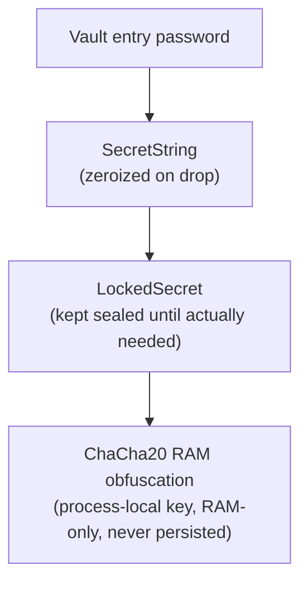

# Cryptographic Architecture

## 1. Vault encryption at rest (on disk)

**Why this chain, and not just "password encrypts data":**
- Argon2id makes brute-forcing the master password computationally expensive.
- The Vault Key is random and independent of the password, so changing the master password only re-wraps the Vault Key (via a new KEK) — it does **not** require re-encrypting the whole vault.
- HKDF derives a unique key per entry from the Vault Key, so no two entries share a key.
- AES-256-GCM provides both confidentiality and integrity (tampering is detected).

## 2. In-memory protection while the vault is unlocked (RAM)

**Purpose:** while the app is running and the vault is unlocked, decrypted entry passwords normally sit in RAM as plain readable text for as long as they're loaded. This layer keeps them XOR-obfuscated with a ChaCha20 keystream at rest in memory, and only briefly decrypts them into a short-lived `SecretString` when displayed, copied, or edited.

This is **not** a replacement for the AES-256-GCM envelope in diagram 1 — it's a defense-in-depth measure against passive memory inspection (core dumps, debugger attachment, swapped pages), not a substitute for the on-disk cryptography.

## Summary

| | Protects | When it matters |
|---|---|---|
| Diagram 1 (Argon2id → KEK → AES-256-GCM → Vault Key → HKDF → Entry Keys) | The vault file on disk | App is closed / vault is locked |
| Diagram 2 (SecretString → LockedSecret → ChaCha20) | Decrypted secrets in RAM | App is running / vault is unlocked |
